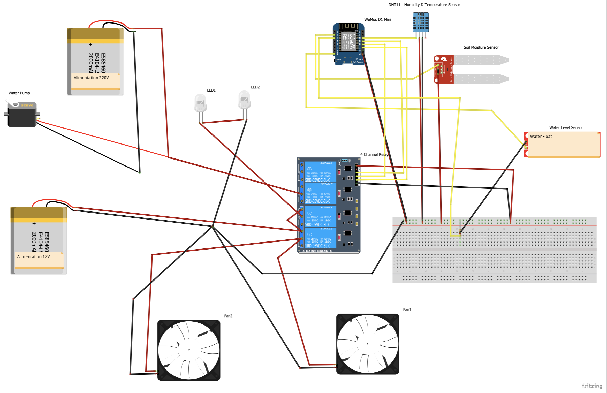
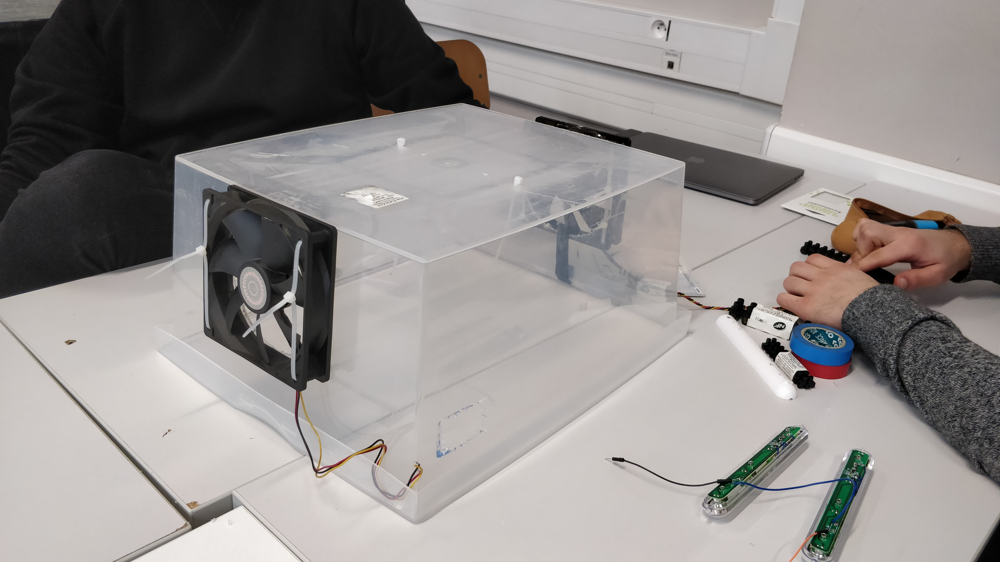
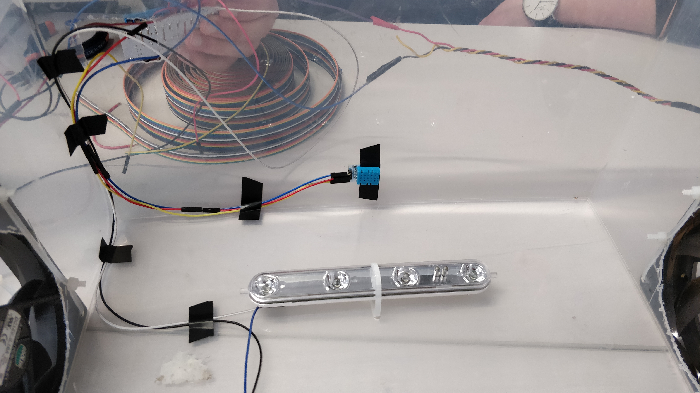
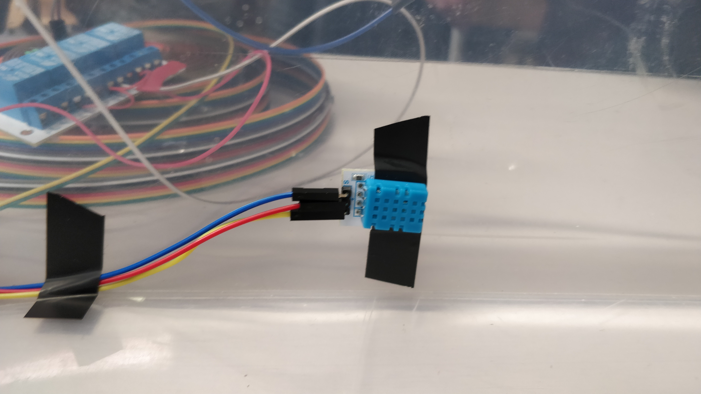
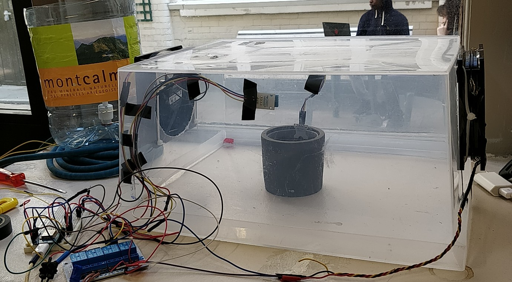
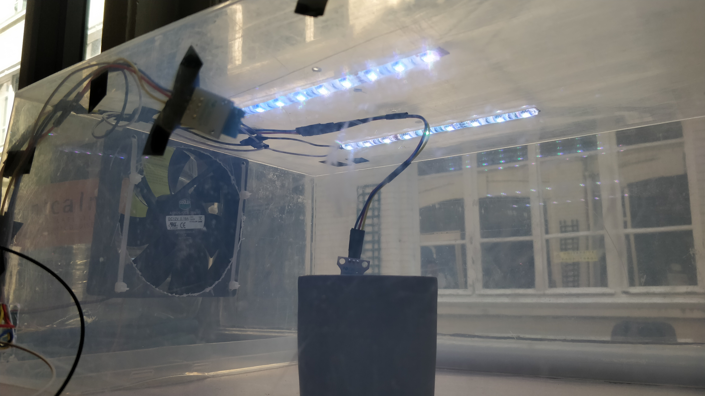

# Bienvenue sur le Projet de Serre Autonome avec Arduino

## Présentation

Le but de ce projet est de réaliser une serre domestique autonome à l'aide d'un module Arduino. Cette serre sonde en permanence la température, l'humidité ambiante, l'humidité de la terre et le niveau d'eau du réservoir, et déclenche l'arrosage ou la ventilation le cas échéant selon des règles pré-établies. 
Cette serre est connectée à Cayenne, une application disponible sur iOS et Android qui permet de visualiser rapidement et facilement les données émises par le module Arduino, et permet également d'envoyer des commandes. 

## Matériel Utilisé 

- 1 Wemos D1 mini ESP8266
- 1 Capteur d’humidité et de température (DHT11)
- 1 Capteur d’humidité dans le sol
- 1 Capteur de niveau d’eau (flotteur)
- 2 ventilateurs d’ordinateur fixe
- 1 alimentation d’ordinateur portable
- 2 bandes de LED 
- 1 Module relais (4 channel)
- 1 Plaque de test
- 1 pompe à eau (type château de Versailles)
- 1 Tuyau en plastique pour arrosage (2 mètres)
- 1 Réservoir d'Eau
- 1 boite en plastique transparente assez grande

__Total : 200€__ 

## Schéma du Montage Électrique

## Règles de Fonctionnement

La serre autonome est réglée selon certains critères. Pour la lumière, il est conseillé d'illuminer la serre 12 heures par jour. L'arrosage se fait selon l'humidité dans la terre et selon l'humidité ambiante. Enfin la ventilation se fait si l'humidité ou la température est trop élevée dans la serre. 

Les seuils retenus dans notre cas d'étude (le Basilic): 

- Humidité maximum en été : 60%
- Humidité maximum en hiver : 80%
- Humidité minimum toute saison : 20%
- Température maximum de la serre : 25°C
- Humidité minimum de la terre : 20%
- Humidité maximum de la terre : 80%
- Début de la journée : 8H
- Fin de la journée : 20h

## Tutoriel 

Découper la caisse en plastique sur les largeurs, en forme de cercle et à la taille du corps des ventilateurs. Découper un petite trappe d'accés à la base d'une des longueur pour insérer les fils des capteurs et des lumières, ainsi que les tuyaux d'arrosage. 

Fixer les ventilateurs de manière à ce qu'un insuffle et l'autre expluse de l'air dans la serre pour le faire circuler.

Fixer les rails de LED branchés en série sur le sommet de la caisse en plastique, à l'intérieur.

Fixer le capteur d'humidité et de température sur une paroi de la caisse à l'intérieur. 

Préparer le capteur d'humidité dans la terre de manière.

Fixer les différents câbles proprement à l'intérieur de la serre et les amener vers la trappe à la base de la caisse. 

A l'extérieur de la caisse, fixer la carte relais et le Wemos. Préparer un conteneur dans lequel sera fixer un flotteur, au fond. Ce conteneur recevra également la pompe. 

Suivre le schéma électrique précisemment pour effectuer les branchements. À l'aide du logiciel Arduino, téléverser le script ino suivant, en ajoutant au préalable vos identifiants Cayenne et vos identifiants d'accès à internet. 
Pour Faire fonctionner le script, dans gestionnaire de bibliothèques, il est nécessaire d'ajouter :
- DHT Sensor Library
- Adafruit Unified Sensor
- NTPClient
- Cayenne MQTT for ESP 

Le dernier se trouve à cette adresse [GitHub](https://github.com/myDevicesIoT/Cayenne-MQTT-ESP.git)

## Retour d'Expérience

Avec autant de composants, un calcul des besoins en alimentations est très importants. Nous pensions avoir suffisamment d'énergie pour alimenter les capteurs et la lumière par exemple grâce au module Wemos mais non. Ensuite, nous avons déporter la lumière sur une carte relais mais cette fois il y avait trop de courant, nous avons griller les lampes...
Enfin, si il y a utilisation d'une carte relais comme nous, il faut faire très attention au sens de branchement du courant électrique. 

## Quelques Photos

